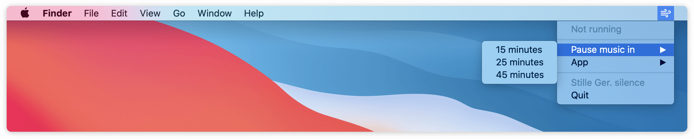

#  Stille

*Timer with a subtle, playback-based reminder, living in your Mac's menu bar.*

I was looking for a way to remind myself to take breaks throughout working days without disturbing myself when I don't want to be disturbed.
I had too many alarms go off, breaking my workflow when I was close to finding the answer to everything.
As I'm listening to music a lot during the day, I reutilized music playback by automatically stopping it after a timer has elapsed.
Whenever I realize the music has stopped, I take a break.
If not, it's probably not the time for a break.

*Stille means silence in German.*

## Usage

Simply start music in either Spotify's desktop client or on soundcloud.com in your Chrome browser.
Next, start Stille and select one of the aforementioned apps in Stille, accessible from your menu bar.
Once this is done, select a period when to pause the playback.
The timer is now running and you can concentrate on the important things.

Note: You'll need to allow the app to interact with Chrome. This can be done in Chrome -> View -> Developer -> Allow JavaScript from Apple Events.

## Download

Refer to the [most recent release](https://github.com/vitusortner/stille/releases) and download the attached .app file.
